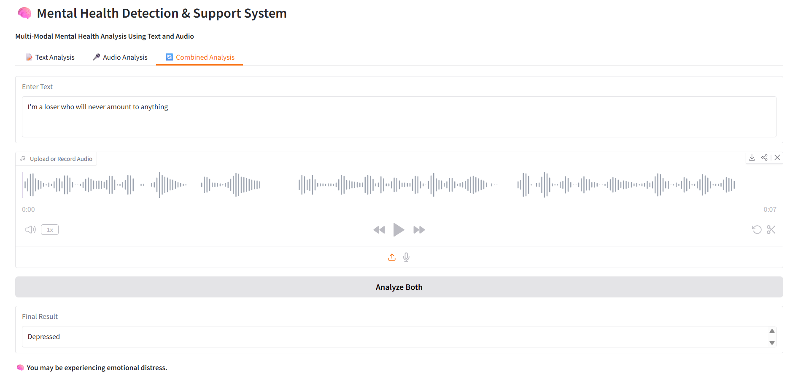

# 🧠 Mental Health Detection & Support System

**Multi-Modal Mental Health Analysis Using Text and Audio**  
This project provides a lightweight, interactive application to detect signs of depression from both **text** and **audio** inputs. The system uses state-of-the-art AI models to provide insights and supportive messages.

-----------------------

## 🌟 Features
- **Text Analysis:** Detects depression from user input text using **DistilBERT**.
- **Audio Analysis:** Recognizes emotions from speech using a **CNN-based audio model**.
- **Combined Analysis:** Integrates text and audio for a more accurate assessment.
- **Support Messages:** Provides mental health resources and suggestions based on the detected condition.
- **User-Friendly Interface:** Built using **Gradio** for web-based interaction.

-----------------------

## 💻 Technologies Used
| Component | Technology |
|-----------|------------|
| Text Analysis Model | HuggingFace `DistilBERT` (TF) |
| Audio Analysis Model | TensorFlow/Keras CNN |
| Audio Processing | `librosa` for MFCC feature extraction |
| Web Interface | `Gradio` Blocks for interactive UI |
| Programming Language | Python 3.x |

------------------------

## 🎯 How It Works
1. **Text Input:**
   - Users type their thoughts.
   - DistilBERT classifies input as `Depressed` or `Not Depressed`.
2. **Audio Input:**
   - Users upload or record a short audio clip.
   - Audio is converted into MFCC features.
   - CNN predicts emotion → maps to `Depressed` / `Not Depressed`.
3. **Combined Assessment:**
   - If either modality indicates depression, the final result is `Depressed`.
   - Support messages and helpline resources are displayed accordingly.

--------------------------

## 🛠 Setup Instructions
1. Clone the Repository:
```bash
git clone https://github.com/PrakratiJain17/mental-health-detection-system.git
cd MentalHealthApp

2. Create Virtual Environment & Install Dependencies:
python -m venv venv
source venv/bin/activate  # Linux/Mac
venv\Scripts\activate     # Windows
pip install -r requirements.txt

3. Download trained models:
Download all model files from this Drive folder: https://drive.google.com/drive/u/0/folders/15_1ZglKmzCIPbXLrXexDke5wxKgcUD7W

4. Run the App: 
python app.py

---------------------------

📊 Supported Labels
1.Text:
Not Depressed
Depressed

2.Audio Emotions:
Angry, Disgust, Fear, Happy, Neutral, Sad, Surprise
Depression Mapping for Audio:
Sad, Fear, Disgust, Neutral → Depressed
Others → Not Depressed

📞 Mental Health Support (India)

1.AASRA (24x7): +91-9820466726
2.KIRAN (Govt. of India): 1800-599-0019

⚠️ Disclaimer: This app is for informational purposes only and is not a substitute for professional care. Please consult a mental health professional if needed.

----------------------------

🖼 Screenshots / Demo


-----------------------------

🚀 Future Improvements
1.Add multi-language support for text input.
2.Enhance audio analysis with longer recordings.
3.Integrate live streaming input for real-time emotion tracking.
4.Deploy to Gradio Hub or HuggingFace Spaces for public access.

